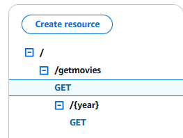
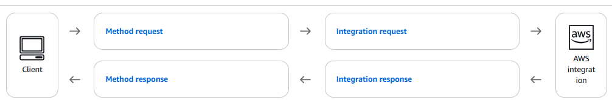

# Serverless API
The goal of this project is to create an API that will display movie information. We should be able to get the list of all the movies stored in our database and a list of all the movies released in a given year. We will be using AWS services especially DynamoDB to store the movie data and API Gateway. In order to create the our different resources, we used the Python SDK (boto3).

 ## 1. Creating the NoSQL Database:
The first step to meet our goal is to create a NOSQL table (DynamoDb) called movies. This table contains the following attributes:
- releaseYear : this served as our primary key as we want to display the list of movie released in a given year
- title: this serves as the secondary key of our table
- director
- ratings 
- genre
Once the table is created, we populate our table with a json file containing about 100 movie titles. 

## 2. Creating the REST API
Next, we move on to creating our REST API. The REST API will facilitate communication betweeen the client and then our Database. Our REST API will contain one resource called "getMovies". Under this resource, we create a GET method and 
In addition, we create a child resource "{year}" under "getMovies" to list movies by year. The brackets indicate the year portion of our path is variable and will change based on the client request. 


### a. Defining our REST API :


To create our API, we need to define :
- *method request* : defines the HTTP verb (GET, PUT, DELETE...) of the client's request to the backend integration. It also specifies the authorization method, the request strings and the request body associated with the method. 
- *method response* : this is the response from the backend transformed for the client. It comes with a status code, a response Model which is basically the expected format of our response and responseParameters that allows us to return or override some parameters before returning them to the client.
- *integration request*: this is where we pass our request to our backend. In addition to specifying the HTTP action, we also need to add the integration type (AWS,AWS_PROXY, HTTP,HTTP_PROXY), the integration method(http method of the service request), the service uri (s the endpoint of the backend service that the API Gateway routes requests to), the mapping template (translates the request from the client into an acceptable format for the backend)
- *integration response*: this is the response  from the backend. Here we define a status code to be returned.  We can define a template response so we have an expected Response for validation or body-mapping templates to transform the output from the backend into a format recognizable by the client(e.g transforming json response to xml).

Let's go through some of the configuration steps of our two methods:

| Steps |getMovies|getMovies/{year}|
|---:|---:|---:|
|method request| GET method created| GET method created|
|-----| No authorization or API Key specified| No authorization or API Key specified|
|  -----     | No request strings or request body passed|  No request strings or request body passed|
|method response|define status code 200 with an empty response Model|define status code 200 with an empty response Model|
|integration request| define a POST action as the integration method|define a POST action as the integration method|
|-----| define the service action as SCAN for the service uri|define the service action as QUERY for the service uri|
----- | Mapping template = {"TableName": table_name}  |Mapping template = {"TableName": table_name,                                  "ExpressionAttributeValues":{':yr': {'N': "$method.request.path.year"} },                                 "KeyConditionExpression" : 'releaseYear = :yr'}|
|integration response|define status code 200 with an empty response Model|define status code 200 with an empty response Model

 
## 3. Permissions:
In terms of permissions, we need to allow our API gateway read permission to our table called movies. First we create the following policy:

```{
    "Version": "2012-10-17",
    "Statement": [
        {
            "Sid": "VisualEditor0",
            "Effect": "Allow",
            "Action": [
                "dynamodb:GetItem",
                "dynamodb:Scan",
                "dynamodb:Query"
            ],
            "Resource": "arn:aws:dynamodb:us-west-1:*:table/Movies"
        }
    ]
}
```
This allows our API to perform "QUERY","SCAN" and "GETITEM" actions on the Movies table. Then we attach this custom policy to a role and we will pass this role to our API.